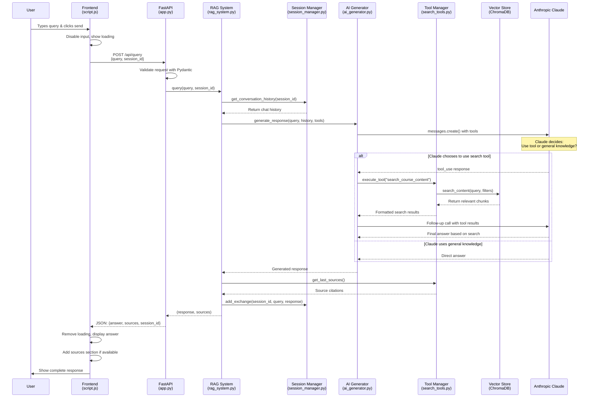
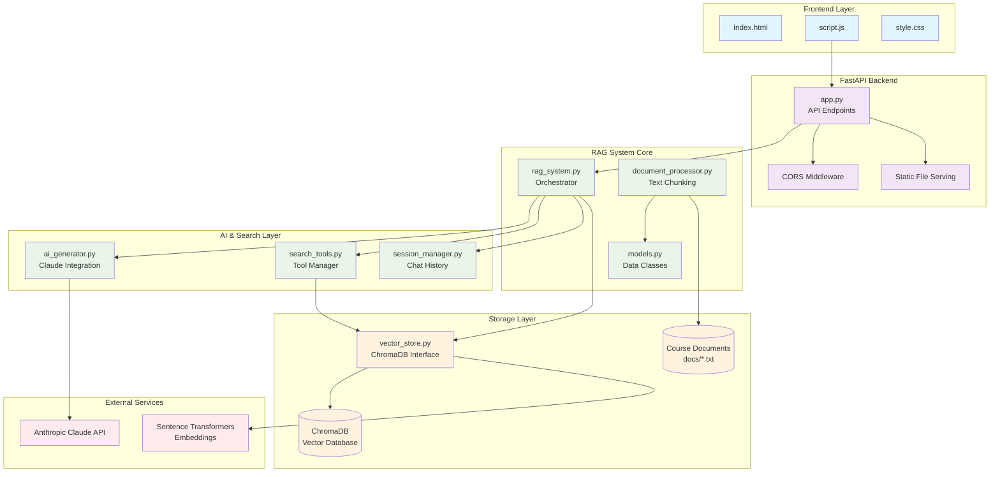
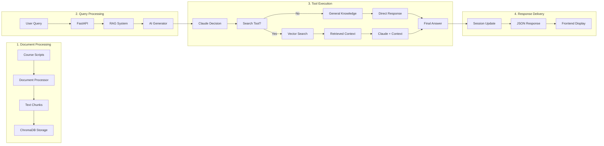

# User Query Processing Flow

```mermaid
sequenceDiagram
    participant U as User
    participant F as Frontend<br/>(script.js)
    participant API as FastAPI<br/>(app.py)
    participant RAG as RAG System<br/>(rag_system.py)
    participant SM as Session Manager<br/>(session_manager.py)
    participant AI as AI Generator<br/>(ai_generator.py)
    participant TM as Tool Manager<br/>(search_tools.py)
    participant VS as Vector Store<br/>(ChromaDB)
    participant Claude as Anthropic Claude

    U->>F: Types query & clicks send
    F->>F: Disable input, show loading
    F->>API: POST /api/query<br/>{query, session_id}
    
    API->>API: Validate request with Pydantic
    API->>RAG: query(query, session_id)
    
    RAG->>SM: get_conversation_history(session_id)
    SM-->>RAG: Return chat history
    
    RAG->>AI: generate_response(query, history, tools)
    
    AI->>Claude: messages.create() with tools
    Note over Claude: Claude decides:<br/>Use tool or general knowledge?
    
    alt Claude chooses to use search tool
        Claude-->>AI: tool_use response
        AI->>TM: execute_tool("search_course_content")
        TM->>VS: search_content(query, filters)
        VS-->>TM: Return relevant chunks
        TM-->>AI: Formatted search results
        AI->>Claude: Follow-up call with tool results
        Claude-->>AI: Final answer based on search
    else Claude uses general knowledge
        Claude-->>AI: Direct answer
    end
    
    AI-->>RAG: Generated response
    RAG->>TM: get_last_sources()
    TM-->>RAG: Source citations
    RAG->>SM: add_exchange(session_id, query, response)
    RAG-->>API: (response, sources)
    
    API-->>F: JSON: {answer, sources, session_id}
    F->>F: Remove loading, display answer
    F->>F: Add sources section if available
    F->>U: Show complete response
```

## Component Architecture

```mermaid
graph TD
    subgraph "Frontend Layer"
        HTML[index.html]
        JS[script.js]
        CSS[style.css]
    end
    
    subgraph "FastAPI Backend"
        APP[app.py<br/>API Endpoints]
        CORS[CORS Middleware]
        STATIC[Static File Serving]
    end
    
    subgraph "RAG System Core"
        RAG[rag_system.py<br/>Orchestrator]
        DOC[document_processor.py<br/>Text Chunking]
        MODELS[models.py<br/>Data Classes]
    end
    
    subgraph "AI & Search Layer"
        AI[ai_generator.py<br/>Claude Integration]
        TOOLS[search_tools.py<br/>Tool Manager]
        SESSION[session_manager.py<br/>Chat History]
    end
    
    subgraph "Storage Layer"
        VS[vector_store.py<br/>ChromaDB Interface]
        CHROMA[(ChromaDB<br/>Vector Database)]
        DOCS[(Course Documents<br/>docs/*.txt)]
    end
    
    subgraph "External Services"
        CLAUDE[Anthropic Claude API]
        EMBED[Sentence Transformers<br/>Embeddings]
    end
    
    %% Frontend connections
    JS --> APP
    
    %% API layer connections
    APP --> RAG
    APP --> CORS
    APP --> STATIC
    
    %% RAG system connections
    RAG --> AI
    RAG --> TOOLS
    RAG --> SESSION
    RAG --> VS
    
    %% Processing connections
    DOC --> MODELS
    VS --> CHROMA
    DOC --> DOCS
    
    %% External connections
    AI --> CLAUDE
    VS --> EMBED
    TOOLS --> VS
    
    %% Styling
    classDef frontend fill:#e1f5fe
    classDef backend fill:#f3e5f5
    classDef core fill:#e8f5e8
    classDef storage fill:#fff3e0
    classDef external fill:#ffebee
    
    class HTML,JS,CSS frontend
    class APP,CORS,STATIC backend
    class RAG,DOC,MODELS,AI,TOOLS,SESSION core
    class VS,CHROMA,DOCS storage
    class CLAUDE,EMBED external
```

## Data Flow Summary

```mermaid
flowchart LR
    subgraph "1. Document Processing"
        A[Course Scripts] --> B[Document Processor]
        B --> C[Text Chunks]
        C --> D[ChromaDB Storage]
    end
    
    subgraph "2. Query Processing"
        E[User Query] --> F[FastAPI]
        F --> G[RAG System]
        G --> H[AI Generator]
    end
    
    subgraph "3. Tool Execution"
        H --> I[Claude Decision]
        I --> J[Search Tool?]
        J -->|Yes| K[Vector Search]
        J -->|No| L[General Knowledge]
        K --> M[Retrieved Context]
        L --> N[Direct Response]
        M --> O[Claude + Context]
        N --> P[Final Answer]
        O --> P
    end
    
    subgraph "4. Response Delivery"
        P --> Q[Session Update]
        Q --> R[JSON Response]
        R --> S[Frontend Display]
    end
```